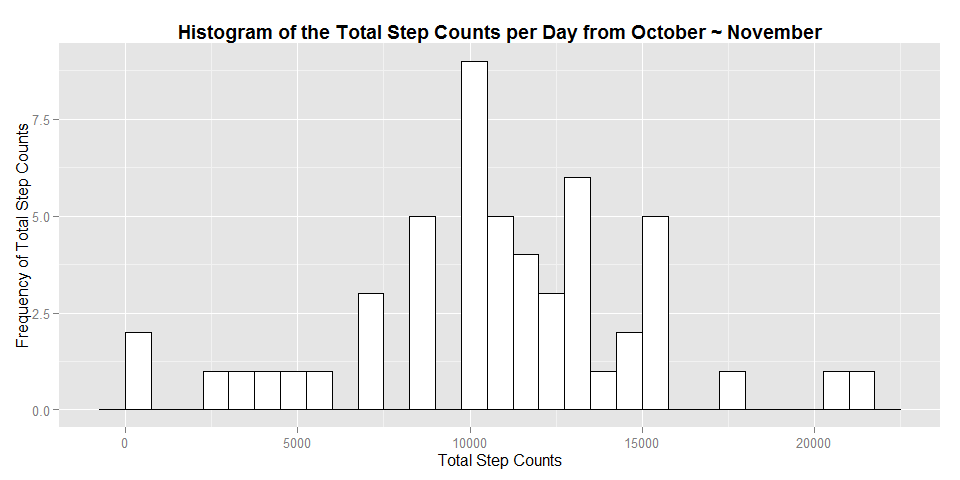
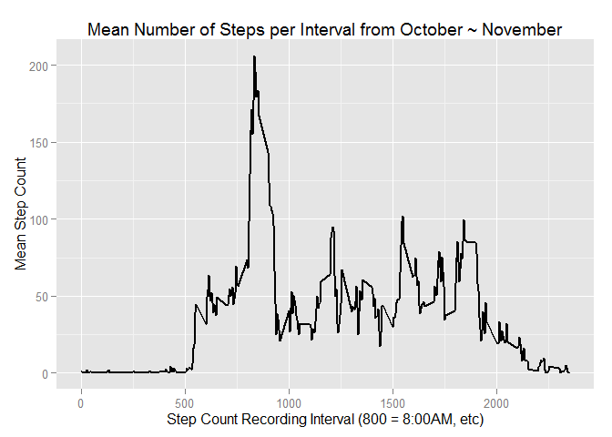
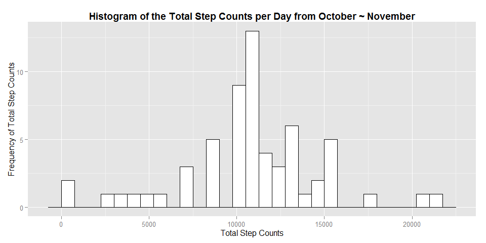
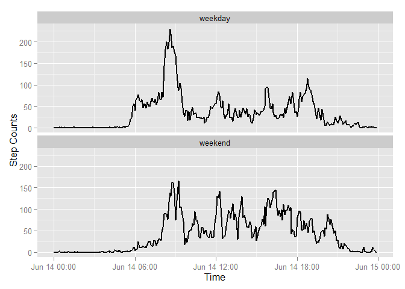

# Wearable Pedometer/Activity Tracker Mini-Study

This assignment makes use of data from a personal activity monitoring device. This device collects data at 5 minute intervals through out the day. The data consists of two months of data from an anonymous individual collected during the months of October and November, 2012 and include the number of steps taken in 5 minute intervals each day.

## Loading and preprocessing the data
(1) Loading the necessary libraries

```r
# load the libraries we will need
library(ggplot2)
library(dplyr)
library(gridExtra)
```
(2) Read in the data

```r
# Read csv file
activity<-read.csv("./activity.csv", header=TRUE, sep=",", )
# Convert Date column from Factor to Date class
activity$date<-as.Date(activity$date)
# Summary of the Activity
summary(activity)
```

```
##      steps             date               interval     
##  Min.   :  0.00   Min.   :2012-10-01   Min.   :   0.0  
##  1st Qu.:  0.00   1st Qu.:2012-10-16   1st Qu.: 588.8  
##  Median :  0.00   Median :2012-10-31   Median :1177.5  
##  Mean   : 37.38   Mean   :2012-10-31   Mean   :1177.5  
##  3rd Qu.: 12.00   3rd Qu.:2012-11-15   3rd Qu.:1766.2  
##  Max.   :806.00   Max.   :2012-11-30   Max.   :2355.0  
##  NA's   :2304
```

```r
# Number of observations and variables for the activity dataset
obs<-nrow(activity)
vars<-ncol(activity)
```
(3) Obtain observations with complete information

```r
# Summary of the Activity with complete information
activity_Complete <- na.omit(activity)
activity_Complete$date <- as.factor(activity_Complete$date)
summary(activity_Complete)
```

```
##      steps                date          interval     
##  Min.   :  0.00   2012-10-02:  288   Min.   :   0.0  
##  1st Qu.:  0.00   2012-10-03:  288   1st Qu.: 588.8  
##  Median :  0.00   2012-10-04:  288   Median :1177.5  
##  Mean   : 37.38   2012-10-05:  288   Mean   :1177.5  
##  3rd Qu.: 12.00   2012-10-06:  288   3rd Qu.:1766.2  
##  Max.   :806.00   2012-10-07:  288   Max.   :2355.0  
##                   (Other)   :13536
```

```r
# Number of observations and variables for the activity of complete dataset
obs2<-nrow(activity_Complete)
vars2<-ncol(activity_Complete)
```

## What is mean total number of steps taken per day?
(1) Summarize the Total number of steps per day

```r
activity_sum <- activity_Complete %>% 
        group_by(date) %>% 
        summarise (step.sum = sum(steps)) 
activity_sum
```

```
## Source: local data frame [53 x 2]
## 
##          date step.sum
## 1  2012-10-02      126
## 2  2012-10-03    11352
## 3  2012-10-04    12116
## 4  2012-10-05    13294
## 5  2012-10-06    15420
## 6  2012-10-07    11015
## 7  2012-10-09    12811
## 8  2012-10-10     9900
## 9  2012-10-11    10304
## 10 2012-10-12    17382
## ..        ...      ...
```
(2) Histogram

```r
p <- ggplot(activity_sum, aes(x=step.sum)) + geom_histogram(binwidth=750, colour="black", fill="white")
p <-  p+ggtitle("Histogram of the Total Step Counts per Day from October ~ November")+ theme(plot.title = element_text(lineheight=.8, face="bold"))
p<-p+xlab("Total Step Counts") + ylab("Frequency of Total Step Counts")
p
```

 
(3) Report of Mean and Median

```r
data_mean <- round(mean(activity_sum$step.sum))
data_median <- median(activity_sum$step.sum)
```
Mean of the total number of steps taken per day = 1.0766\times 10^{4}

Median of the total number of steps taken per day = 10765

## What is the average daily activity pattern?
(1) Summarize data by interval

```r
# A complete activity group by interval
activity_interval <- na.omit(activity)
activity_interval$interval <- as.factor(activity_interval$interval)
# Group by interval factor and take average
activity_inter <- activity_interval %>% 
        group_by(interval) %>% 
        summarise (step.mean = mean(steps))
activity_inter
```

```
## Source: local data frame [288 x 2]
## 
##    interval step.mean
## 1         0 1.7169811
## 2         5 0.3396226
## 3        10 0.1320755
## 4        15 0.1509434
## 5        20 0.0754717
## 6        25 2.0943396
## 7        30 0.5283019
## 8        35 0.8679245
## 9        40 0.0000000
## 10       45 1.4716981
## ..      ...       ...
```

```r
l <- ggplot(activity_inter, aes(x=as.numeric(levels(interval))[interval], y=step.mean, group=1)) + geom_line( linetype="solid", size=1)
l <- l + scale_x_continuous(breaks=c(0,500,1000, 1500, 2000, 2500))
l <- l + ggtitle("Mean Number of Steps per Interval from October ~ November")
l <- l + xlab("Step Count Recording Interval (800 = 8:00AM, etc)") + ylab("Mean Step Count")
l
```

 

(2) Find the 5-minute interval that contains the maximum number of steps

```r
result<-activity_inter[which.max(activity_inter$step.mean),]
inter <- round(result[2])
```
The most active interval for this user is 206 steps at the 8:35AM interval.

## Imputing missing values
(1) Create a dataframe with the missing data

```r
missing_index <- is.na(activity[,1])
activity_missing <-activity[missing_index,]
n_missing <- nrow(activity_missing)
```
Number of missing data = 2304

(2) Impute missing data with step mean

```r
for(i in 1:nrow(activity)){
        if(is.na(activity[i,]$steps)){
                imp_inter <- activity[i,]$interval
                activity[i,]$steps <- activity_inter[which(imp_inter==activity_inter$interval),]$step.mean
                }        
}
summary(activity)
```

```
##      steps             date               interval     
##  Min.   :  0.00   Min.   :2012-10-01   Min.   :   0.0  
##  1st Qu.:  0.00   1st Qu.:2012-10-16   1st Qu.: 588.8  
##  Median :  0.00   Median :2012-10-31   Median :1177.5  
##  Mean   : 37.38   Mean   :2012-10-31   Mean   :1177.5  
##  3rd Qu.: 27.00   3rd Qu.:2012-11-15   3rd Qu.:1766.2  
##  Max.   :806.00   Max.   :2012-11-30   Max.   :2355.0
```
(3) Histogram

```r
activity_impute <- activity %>% 
        group_by(date) %>% 
        summarise (step.sum = sum(steps)) 
activity_impute
```

```
## Source: local data frame [61 x 2]
## 
##          date step.sum
## 1  2012-10-01 10766.19
## 2  2012-10-02   126.00
## 3  2012-10-03 11352.00
## 4  2012-10-04 12116.00
## 5  2012-10-05 13294.00
## 6  2012-10-06 15420.00
## 7  2012-10-07 11015.00
## 8  2012-10-08 10766.19
## 9  2012-10-09 12811.00
## 10 2012-10-10  9900.00
## ..        ...      ...
```

```r
p <- ggplot(activity_impute, aes(x=step.sum)) + geom_histogram(binwidth=750, colour="black", fill="white")
p <-  p+ggtitle("Histogram of the Total Step Counts per Day from October ~ November")+ theme(plot.title = element_text(lineheight=.8, face="bold"))
p<-p+xlab("Total Step Counts") + ylab("Frequency of Total Step Counts")
p
```

 
(4) Report of Mean and Median

```r
data_impute_mean <- round(mean(activity_impute$step.sum))
data_impute_median <- median(activity_impute$step.sum)
```
Mean of the total number of steps taken per day = 1.0766\times 10^{4}

Median of the total number of steps taken per day = 1.0766189\times 10^{4}

There are little difference in the mean and median by imputing the missing data for each interval with the respective step mean.

## Are there differences in activity patterns between weekdays and weekends?
(1) Create dataset with two levels: "weekday" and "weekend"eekend day.

```r
weekends <- activity$date
weekends <- weekdays(weekends) %in% c("Saturday", "Sunday")
activity <- transform(activity, week = ifelse(weekends ,'weekend', 'weekday'))
activity$week <- as.factor(activity$week)
```
(2) Panel plot of Time series over weekday days or weekend days

```r
steps_Week <- aggregate(activity, list(interval = activity$interval, week = activity$week), mean)
steps_Week$time <- formatC(steps_Week$interval, width = 4, format = "d", flag = "0")
steps_Week$time <- as.POSIXct(steps_Week$time, format="%H%M")
g <- ggplot(steps_Week, aes(x = time, y = steps))
g <- g + geom_line( linetype="solid", size=1)
g <- g + facet_wrap(~week, ncol=1)
g <- g+xlab("Time") + ylab("Step Counts")
g
```

 
